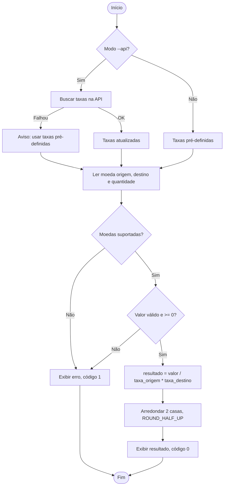

# Documentação Técnica — Conversor de Moedas

> Obs.: o enunciado pede a documentação da "funcionalidade login", mas o resto da atividade é sobre o conversor. Considerei que foi engano e documentei o **conversor de moedas**.

## 1. Descrição da funcionalidade

O conversor permite ao usuário escolher a moeda de origem e a de destino (USD, EUR ou BRL), informar uma quantidade e receber o valor equivalente, com **2 casas decimais** e arredondamento **half-up** (0,005 → 0,01).

As taxas vêm de uma API pública (`open.er-api.com`) quando o modo `--api` é usado; se a API falhar, o sistema usa taxas pré-definidas (fallback).

### Critérios de aceitação

| ID | Critério | Testes que cobrem |
|----|----------|-------------------|
| CA1 | O usuário seleciona moeda de origem e destino | `TestCA1SelecionarMoedas` |
| CA2 | O usuário informa a quantidade da moeda de origem | `TestCA2CA3...`, `TestInterface` |
| CA3 | O sistema exibe o valor equivalente na moeda de destino | `TestCA2CA3...`, `TestInterface.test_fluxo_feliz` |
| CA4 | Precisão mínima de 2 casas decimais | `TestCA4CA5...` |
| CA5 | Arredondamento correto (half-up) | `TestCA4CA5...` |

Regras de negócio adicionais: valor negativo, não numérico, NaN e infinito são rejeitados; zero é permitido; vírgula é aceita como separador decimal; códigos de moeda são case-insensitive.

## 2. Diagrama de fluxo



## 3. Interfaces necessárias

**Interface de usuário (CLI)** — `python -m currency_converter.cli [--api]`

```
Moedas disponíveis: USD, EUR, BRL
Moeda de origem: usd
Moeda de destino: brl
Quantidade: 10
10 USD = 55.00 BRL
```

**Interface de programação**

| Elemento | Assinatura | Descrição |
|----------|-----------|-----------|
| `CurrencyConverter.convert` | `(from, to, amount) -> Decimal` | Converte e arredonda |
| `CurrencyConverter.fetch_rates` | `() -> dict` | Atualiza taxas via API |
| `CurrencyConverter.rates_are_fresh` | `(max_age_seconds=86400) -> bool` | Taxas com menos de 24h? |
| `parse_amount` | `(value) -> Decimal` | Valida e converte a quantidade |
| `cli.run` | `(input_fn, print_fn, converter, use_api) -> int` | Fluxo interativo; funções injetáveis para teste |

**Exceções:** `CurrencyError` (base) → `UnsupportedCurrencyError`, `InvalidAmountError`, `RatesUnavailableError`.

## 4. Banco de dados / armazenamento

Não usei banco de dados. As taxas ficam só na memória (um `dict` de `Decimal`, sempre em relação a 1 USD) enquanto o programa roda. As taxas de reserva estão em `DEFAULT_RATES`, no código, e são valores de exemplo que precisam ser atualizados de vez em quando. Como nada é salvo, também não guardo nenhum dado do usuário.

## 5. APIs e serviços externos

| Item | Detalhe |
|------|---------|
| Serviço | ExchangeRate-API (endpoint aberto) |
| URL | `https://open.er-api.com/v6/latest/USD` |
| Autenticação | Nenhuma |
| Campos usados | `result`, `rates`, `time_last_update_unix` |
| Timeout | 5 s |
| Falhas tratadas | Rede indisponível, JSON inválido, `result != success`, moeda ausente |
| Fallback | Taxas pré-definidas + aviso ao usuário |

Se for usar além da atividade, vale ler os termos de uso e o limite de requisições do serviço.

## 6. Como executar

```bash
python -m currency_converter.cli          # taxas pré-definidas
python -m currency_converter.cli --api    # taxas da API
python -m unittest -v                     # testes
```
